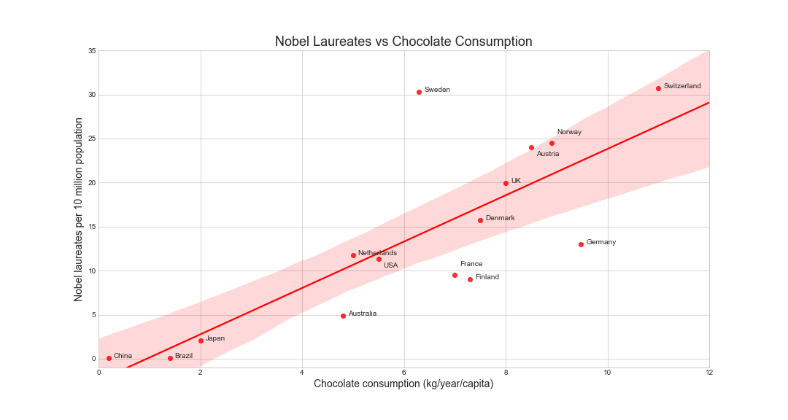

# ChocolateNobels

Chocolate consumption could hypothetically improve cognitive function not only in individuals but in whole populations. 
Could there be a correlation between a country's level of chocolate consumption and its total number of Nobel laureates per capita?

Inspired by article: http://www.nejm.org/doi/full/10.1056/NEJMon1211064
Data taken from wikipedia

